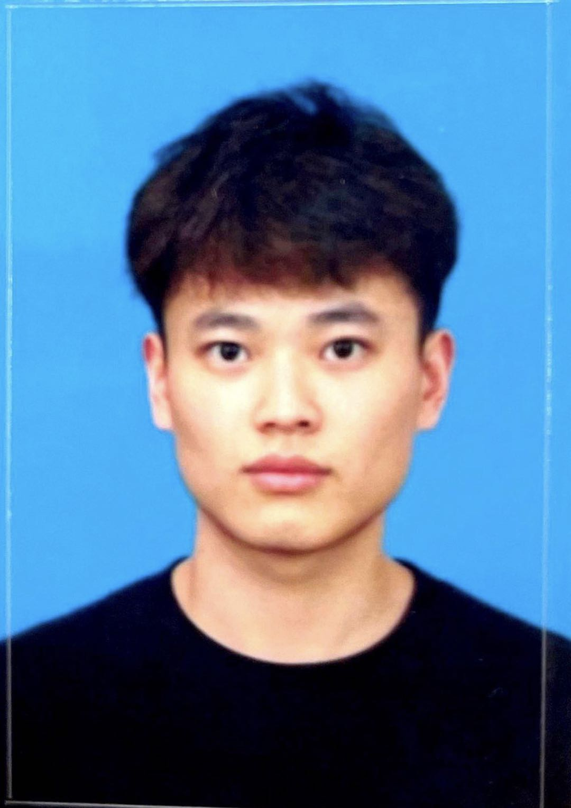

<h1 align="left">
    
    
 Liao Xuankun 

</h1>

## Biography

I'm currently a year 2 Phd student in the [Database Group](https://www.comp.hkbu.edu.hk/~db/index.html) of the [Department of Computer Science](https://www.comp.hkbu.edu.hk/v1/), Hong Kong Baptist University (HKBU) supervised by [Prof. Jianliang Xu](https://www.comp.hkbu.edu.hk/~xujl/). I obtained my Bachelor's degree from the School of Electronic Information and Communications [(EIC)](http://ei.hust.edu.cn/English/Home.htm), Huazhong University of Science and Technology [(HUST)](https://www.hust.edu.cn/) in 2020.

## Research Interests

I am interested in graph data management, especially distributed and parallel graph computation. I also have interest in developing efficient algorithms for streaming graph computation.  

## Contact

Email: xkliao@comp.hkbu.edu.hk

## Publications [[DBLP]](https://dblp.org/pid/313/9191.html) [[Google Scholar]](https://scholar.google.com/citations?hl=zh-CN&user=s9Kv6Q4AAAAJ)

1. **Xuankun Liao\***, Qing Liu\*, Jiaxin Jiang, Xin Huang, Jianliang Xu, and Byron Choi, “Distributed
d-core decomposition over large directed graphs,” Proceedings of the VLDB Endowment (**PVLDB**), vol. 15, no. 8, pp. 1546–1558, 2022. (*equal contribution)

## Honors & Awards
1. Outstanding Graduate, HUST, 2020 
